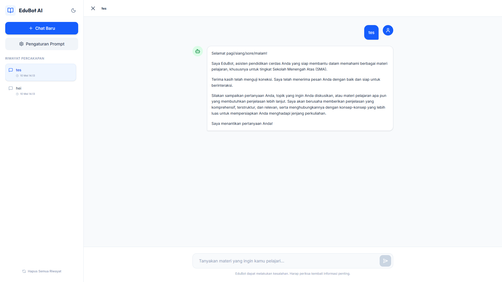
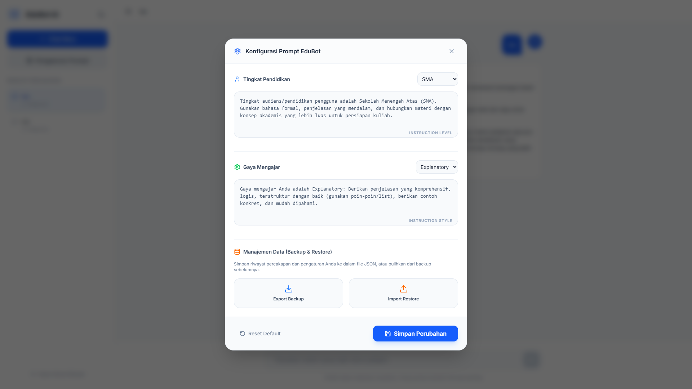

# EduBot AI - Smart Educational Assistant

EduBot AI adalah asisten pendidikan cerdas yang ditenagai oleh Google Gemini API (model `gemini-2.5-flash`). Proyek ini dirancang untuk memberikan pengalaman belajar yang personal melalui interaksi AI yang adaptif dan kontrol penuh atas instruksi pengajaran.

## Fitur Unggulan

- **Real-time Streaming**: Respons AI ditampilkan secara instan saat data dihasilkan, memberikan pengalaman percakapan yang sangat responsif dan minim waktu tunggu.
- **Manajemen Data (Backup & Restore)**:
  - **Export**: Simpan seluruh riwayat chat dan pengaturan ke dalam file JSON.
  - **Individual Export**: Unduh percakapan tertentu langsung dari sidebar.
  - **Smart Merge**: Impor data backup tanpa menghapus riwayat yang sudah ada.
- **Kustomisasi Prompt Dinamis**: Pengguna dapat mengedit instruksi sistem (*system instruction*) untuk setiap tingkat pendidikan dan gaya mengajar secara langsung melalui UI.
- **Visual & UX Premium**:
  - **Tipografi Modern**: Menggunakan font **Outfit** untuk judul dan **Inter** untuk teks konten.
  - **Syntax Highlighting**: Blok kode pemrograman ditampilkan dengan pewarnaan yang elegan.
  - **Copy to Clipboard**: Salin pesan bot atau blok kode dengan satu klik.
- **Mode Gelap Persisten**: Dukungan penuh mode gelap yang nyaman untuk mata, tersimpan otomatis di browser.
- **Metode Pengajaran Adaptif**: Bot dapat diatur untuk mengajar dengan metode Socratic, Explanatory, atau Summary sesuai kebutuhan belajar.

## Struktur Proyek

- **`backend/`**: Server Node.js + Express. Menangani komunikasi API, validasi data menggunakan Zod, dan manajemen konteks chat secara native.
- **`frontend/`**: Aplikasi React + Vite. Antarmuka pengguna modern dengan Tailwind CSS v4, Framer Motion untuk animasi, dan Lucide icons.

## Cara Menjalankan

### Backend
1. Masuk ke folder `backend`.
2. Buat file `.env` dan tambahkan `GEMINI_API_KEY=MASUKKAN_KEY_ANDA`.
3. Jalankan `npm install` kemudian `node index.js`.

### Frontend
1. Masuk ke folder `frontend`.
2. Jalankan `npm install` kemudian `npm run dev`.
3. Akses aplikasi melalui `http://localhost:5173`.

---
*Dikembangkan untuk memberikan kebebasan kustomisasi dalam asisten pendidikan AI.*
